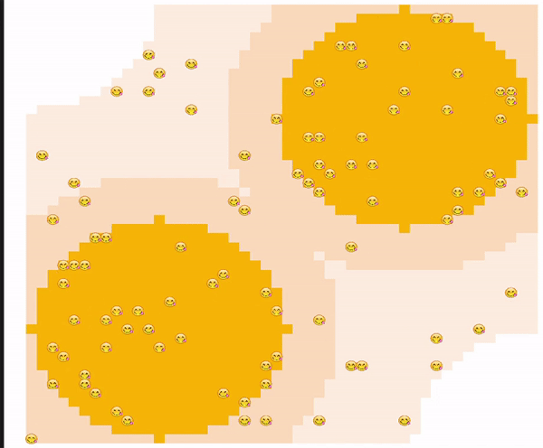

# Rust Sugarscape

---

A simple implementation of the Sugarscape simulation, both with and without UI, fully based on the RustAB framework. The objectives of the simulation are simple:

- There is a field with some slots, called "patches", each one with a specific amount of sugar.
- A specific amount of agents, called eaters, are placed into the field. Each agent has the following attributes:
  - Age: how many steps are passed since its birth
  - Max Age: the maximum age it can reach before it dies
  - Wealth: the amount of sugar it ate
  - Metabolism: the amount of sugar it digests every step
  - Vision: the radius of the area where it searches free patches
- Each agent has to find a free patch with the highest amount of sugar near him.
- If a free patch has been found, the agent moves to its position and "eats" the amount of sugar of that patch.
- If an agent reaches its max age, or its wealth goes below zero, it respawns in a random position inside the field.

---

---

# How to run

---

- To run only the simulation, run `cargo run --release`.
- To run the native visualization, run `cargo make run --profile release`.
- To serve the web visualization locally, run `cargo make serve --profile release`.
