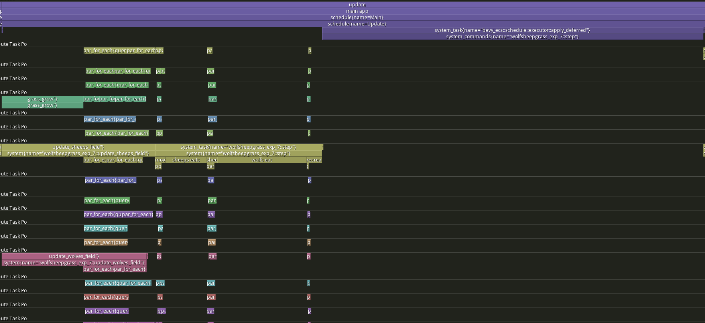

# EXPERIMENT 7

## WHAT IS THE PROBLEM NOW
After we have solved/mitigated the problem of updating fields during the simulation migrating it to parallel, we have left one great operation like a sequential inefficient block: the deferred applying of commands.

We have used [ParallelCommands](https://docs.rs/bevy/latest/bevy/prelude/struct.ParallelCommands.html) to delay the insertion/deletion from pool of entities to not create race condition about the entire structure during the process of reproduction/killing of elements that is realized in parallel.
All the commands that we create is then applyed in sequential at the end of step/frame.

This create some problem, this part takes more time than the entire simulation.

## NEW IMPLEMENTATION
The idea is to stop using ParallelCommands to save the agents to spawn.
We can easily optimize the spawning of new agents with [spawn_batch](https://docs.rs/bevy/latest/bevy/ecs/prelude/struct.Commands.html#method.spawn_batch). We can pass an iterator to spawn_batch for the data we want to use to initialize the new agents(entities in general).

So the idea is to accumulate all the data for the new agents in a single buffer to initialize then the new agents.
But we must share this buffer in a parallel context, so we tried to use [Parallel](https://docs.rs/bevy/latest/bevy/utils/struct.Parallel.html) from bevy_utils.